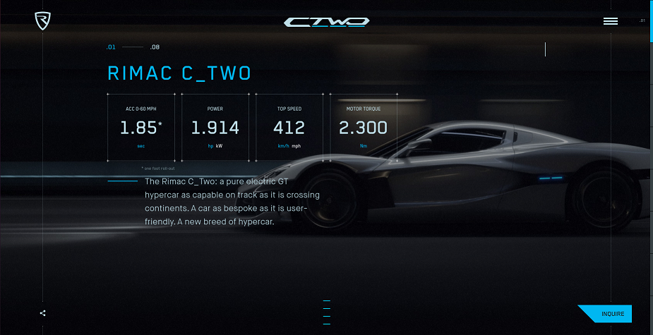
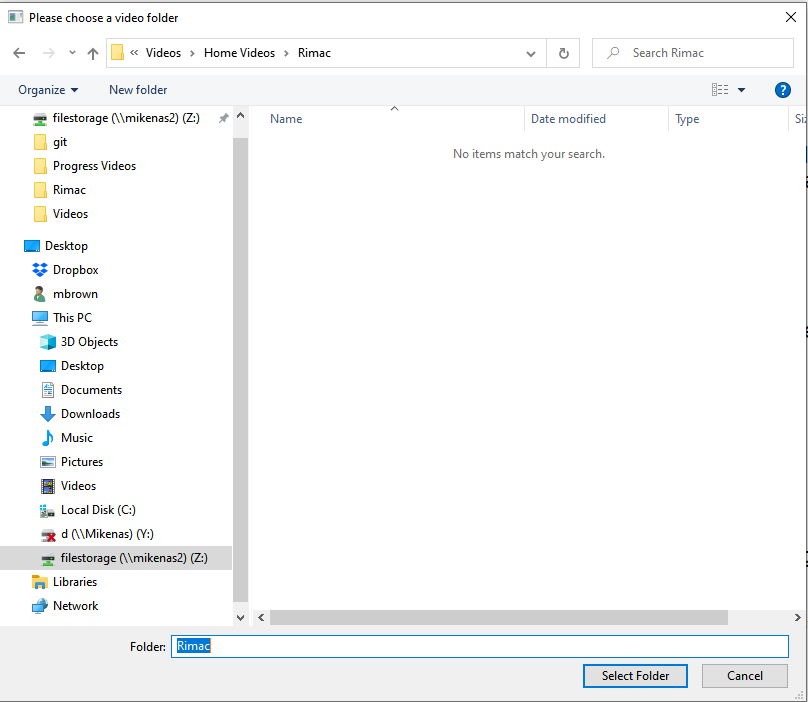
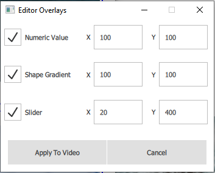
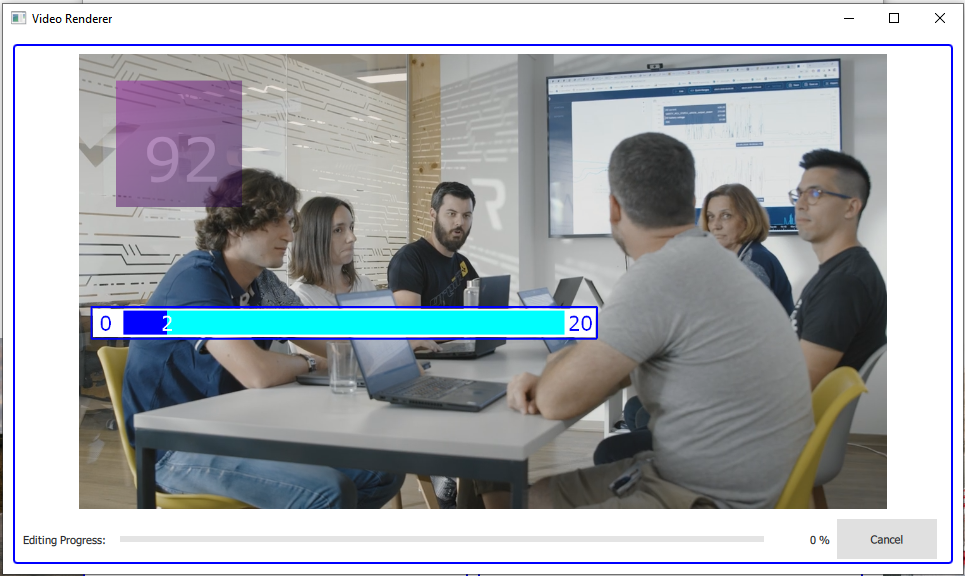
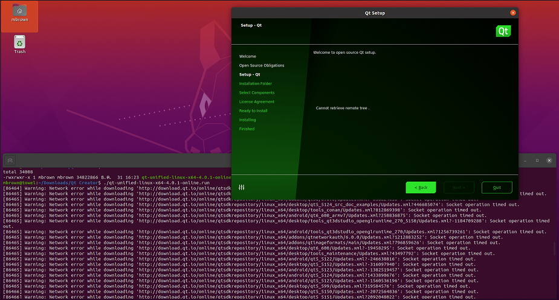
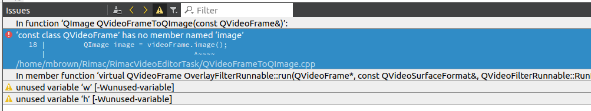
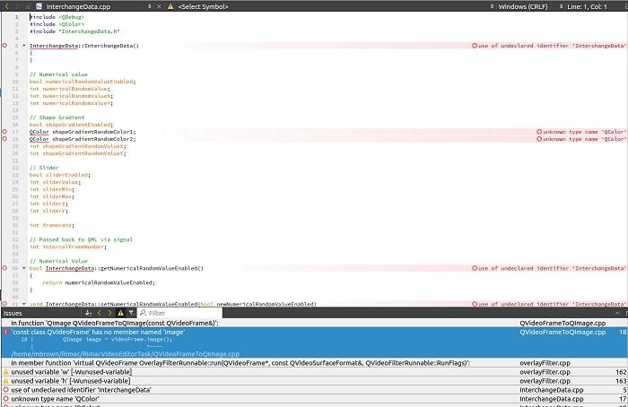

This my submission for the **Qt Video Browser & After Effects Application** task as part of the Rimac Automobili IVI software developer role application process.



Please view the accompanying video on my YouTube channel, which shows a walkthrough of the application, techniques used and issues found, as if I was explaining it to a friend.  https://youtu.be/gdnI1SF7t7g

I have no previous experience with Qt or the QtCreator tool, so I had to start from scratch.  Concepts from other IDEs and graphical frameworks helped, but Qt has some unique aspects, such as its methods of binding data and allowing QML and C++ to exchange data and call each other`s functions.

I was able to complete the task, with one big exception.  My work included Qt installation, research, coding, documentation of code in this README.md file and an accompanying video, Linux installation / Qt setup and github project upload, all in about 72 hours across 7 calendar days.

#Qt Installation and Configuration
I am comfortable with a Windows desktop so I downloaded and installed the Open Source version of QtCreator and built the application there.  Nothing I have written should preclude the code`s  import and execution in a properly configured Qt Creator installation on Ubuntu Linux.

#Research
I did the first Qt tutorial and found a typo and the inability to perform one of the steps in the Design window!  This was not a good start!  Through the course of the week Google was my best friend as I searched Qt documentation, Qt example code, blogs, articles, videos and anything else I could find to continue my development.  As a newbie to Qt I have mixed emotions about it, but I am sure that with more experience and working with the Rimac experts I will become more comfortable with the tools and development patterns that Rimac has developed.

#Prerequisite
If you are using the video components of Qt on Windows, and perhaps other platforms, you must download and install the K-Lite Codec pack from https://codecguide.com/download_k-lite_codec_pack_basic.htm

#User Interface


##Main Window
The main window has some graphical eye-candy of the Concept_One and C_Two cars, and allows the user to select the Raw Videos or Edited Videos parts of the program.  



Clicking either button brings up a dialog that allows the user to choose the location of the video files.  This choice is remembered for subsequent selections to save time.

![RawWindow.png][RawWindow.png]

##Raw Videos
Medium-sized thumbnails of each video found in the user`s directory are shown in two columns, along with a corresponding Edit button.  Clicking on a video plays the unaltered video in a fullscreen window.

Clicking on an **Edit** button is where it gets interesting!



The user can choose to enable any of 3 editing actions:
- Numeric Text
This displays a random number between 0 and 99 at the location specified by the user, changing at a given time interval.

- Rectangle with Color Gradient
This displays a color gradient rectangle, with a random starting and ending color, at the user`s initial location, but then moves it around to random locations at a given time interval.

- Slider Bar
This displays a custom slider bar at the location specified by the user, cycling the slider value and position up and down from 0 to 20 at a given time interval.



When the user clicks the **Apply To Video** button, a video player screen pops up, overlaid with the selected graphical effects.  The effects are animated as the video plays to the end, and a progress bar and percentage complete indicator are updated at the bottom of the window.  This all works well and is entertaining for hours on end for young and old!

#Edited Videos

![EditedWindow.png][EditedWindow.png]

Video thumbnails are displayed in a similar manner to the **Raw Videos** window, but without the Edit button functionality.  Clicking on a thumbail plays the video in a fullscreen window.

In order to keep the user`s original video unscathed, I only show videos in the Edited thumbnail list if they have **Edited** in the filename, which would be generated by the Raw Video effects handling.

# Code Highlights

User interface components were built with standard QML elements, program logic and property notification handling.  The timers for each of the three video effects are generated on the QML side and sent to the C++ side where they are queried for each frame and applied for the specified effect.

The video effects were implemented as a `QVideoFilterRunnable` subclass assigned to the QML ```VideoOutput``` object  displaying the video.  The filter was written in C++, as is required by the Qt architecture.  Given the complexity of dealing with video frames of different sizes, color formats, etc., I found and used a wonderful set of utility classes from Stephen Quan at https://github.com/stephenquan/MyVideoFilterApp, which saved me a lot of tedium working out the arcane aspects of Qt`s handling of image data formats.

I created an ```InterchangeData``` class to exchange data and call methods between QML and C++, using the Qt standard properties, signals and slots.  I needed one instance of the InterchangeData object across the entire application, including the C++ and QML sides, so I used the C++ compiler`s ```extern``` functionality.

#Deployment on Ubuntu Linux
The task description says the code should be able to be built and run on an Ubuntu desktop Linux.  I wanted to test this before uploading the code to github.  I dont have an Ubuntu system, so I installed it in free space on my Thinkpad.  I then installed the Linux version of Qt Creator.  I encountered the following difficulties:



- The Qt Create graphical installer couldn`t phone home to download its components, timing out during several attempts. 



- I then peformed a command-line installation of Qt, Qt Creator and associated modules using standard apt-get install commands.  Unfortunately when I loaded up my project files, I got some strange errors that seemed to point to an incomplete installation of the full Qt environment or a framework version mismatch.  Attempting a build tells me that ```QVideoFrame``` doesn`t have a member method named ```image``` where it clearly does.



- Then as I opened up my .cpp and .h files, I found dozens of flagged issues with things that should be recognized by default like ```QColor``` is an unknnown type.

I`m sure that the Rimac DevOps team has a script that performs a full Qt install on a new machine and this would solve my problem.

#Issue: The Video File is Not Generated

The result of the editing process is supposed to be a new video, identical to the original but with the effects showing on each frame.  I was not able to complete this aspect of the task.  From my research it seems that there is ***no video writing*** functionality within Qt at this time, except if you have a video camera source and use the ```Camera``` object - it can stream to a file, but there is no general-purpose video creation ability.

I researched several ways to get around this issue, but left it undeveloped due to time and portability constraints.  This is one of the more promising approaches:

1.  I have working code that saves each processed video frame as its own ***.png*** image file.
2.  At the end of the video processing, I would launch the ```ffmpeg``` utility via the ```QCommand``` facility in Qt.  ```ffmpeg``` would combine all of the images into a video file.  That unfortunately leaves me with a video file with no sound.  ```ffmpeg``` also has a limitation on Windows where it cannot batch handle thousands of image frames.  This ***could*** potentially work on Linux or Mac.
3.  To handle the audio problem, I would then launch ```ffmpeg``` again and have it extract the audio track of the original video.
4.  I would then use ```ffmpeg``` for the last time to merge the audio track with the image-frames video, and hope that the audio is still in sync wtih the resulting video frames.

I`m sure that the Rimac team has investigated the possibilities of creating a proper output video, given that they use this assignment for potential new hires.  I would be very interested to know how that would work out.

#Conclusion
I thank the Rimac staff for taking the time to evaulate my programming skills to become a member of the development team.

If you have any questions, please contact me at mwbrown42@gmail.com or +1-805-314-1592.


